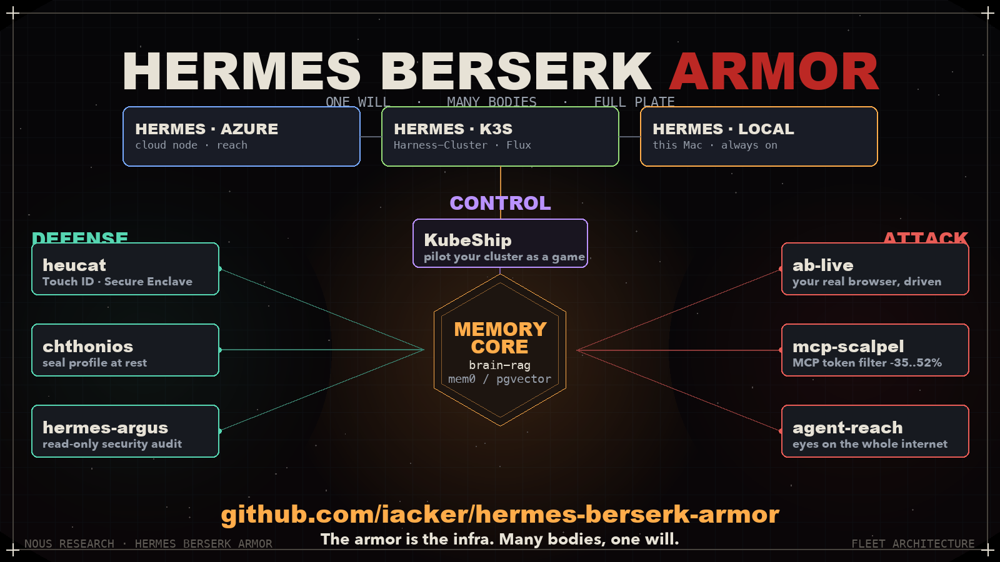

# HBA — Hermes Berserk Armor

HBA is a coherent set of extensions that turn a stock [Hermes](https://github.com/NousResearch/hermes-agent)
agent into a durable, contained, portable operator. It is not a fork and not a
framework: every component plugs into an existing Hermes extension point (MCP
server, plugin, secret source, profile). Installed together they form one system
with a clear division of labour — a memory the agent thinks with, a toolset it
acts with, and a set of controls that bound what any of it can do.

The organising principle is one sentence: **give the agent real power, and pair
every power with a control that limits the blast radius if it is ever turned.**



---

## Why this exists

A stock agent is stateless, trusting, and single-homed. Between sessions it
forgets; its secrets sit in a plaintext `.env`; its whole tool catalog is billed
on every turn; and it lives on exactly one machine. HBA fixes those four gaps
without changing Hermes core:

| Gap in a stock agent | HBA answer |
|----------------------|------------|
| Forgets between sessions | A four-tier memory architecture (below) |
| Secrets in plaintext, full trust | Hardware-sealed keys, encrypt-at-rest profile, continuous self-audit |
| Entire tool catalog billed every turn | Semantic tool-filtering proxy (`mcp-scalpel`) |
| Lives on one machine | One agent projected across a three-body fleet |

---

## Memory: why there are several layers

The layers are not redundant — each serves a different **timescale** and a
different **question**. Human memory separates working memory, episodic memory,
semantic knowledge, and skills for the same reason: one store optimised for
everything is good at nothing. HBA maps each tier to a purpose-built component.

| Tier | Question it answers | Timescale | Component | Hermes surface |
|------|--------------------|-----------|-----------|----------------|
| Working | "What are we doing *right now*?" | this session | `hermes-lcm` | plugin (context compaction) |
| Episodic | "What happened in past sessions, and what did I learn?" | across sessions | `agentmemory` | MCP server |
| Semantic | "What do I *know* about this topic/vault?" | permanent knowledge | `brain-rag-server`, `neuromancer` | MCP servers |
| Identity | "Who is this user and what do they always want?" | stable facts | `mem0` / `pgvector`, Hermes context notes | store + native notes |

### How they work together

```
        turn N of a live session
                 |
                 v
   +-----------------------------+   working memory
   | hermes-lcm                  |   compacts the running conversation into a
   | (context compaction)        |   hierarchical summary DAG + a protected
   +--------------+--------------+   recent tail, so a long session never
                  |                  overflows the window
                  v
   +-----------------------------+   identity memory (always in context)
   | mem0 / pgvector + notes     |   stable facts & preferences injected every
   +--------------+--------------+   turn — no lookup needed
                  |
       need more? | retrieve on demand
                  v
   +--------------+--------------+   +-----------------------------+
   | agentmemory (episodic)      |   | brain-rag / neuromancer     |
   | recall past sessions,       |   | (semantic)                  |
   | lessons, knowledge graph    |   | hybrid RAG over the vault   |
   +--------------+--------------+   +--------------+--------------+
                  |                                 |
                  +----------------+----------------+
                                   v
                        answer for this turn
```

**Read path (per turn):** the agent first uses what is already in context
(working + identity tiers cost nothing to consult). It reaches into episodic or
semantic memory only when the current context is insufficient — the narrowest
bounded lookup that answers the question, not a blanket search of everything.

**Write path (background):** session observations are consolidated by
`agentmemory` into its tiered store and knowledge graph; durable lessons and
user facts are promoted upward (into identity memory) so they load for free next
time; vault documents are indexed by `brain-rag` for semantic recall. Recent,
high-value context is what gets promoted; noise is left to age out.

The net effect: the agent behaves as if it has one memory, but each question is
served by the store that can answer it cheapest and most accurately.

---

## Working and acting: the tool strategy

The strategy is **broad capability, loaded on demand, kept cheap, and bounded.**

1. **Broad capability, grouped by intent.** Tools are organised by what the
   agent is trying to do — reach the world, run a security workflow, drive a
   domain — not dumped into one flat list.

2. **Kept cheap.** A large toolset is expensive: every MCP tool's schema is
   re-injected into every turn. `mcp-scalpel` sits in front of the Docker MCP
   Gateway and routes `tools/list` to the relevant subset, cutting per-turn
   catalog tokens by 35-52%. This is what makes a large toolset affordable
   instead of a permanent tax.

3. **Real-world actions, real identity.** `ab-live` gives the agent your actual
   browser — cookies, sessions, extensions — instead of a headless throwaway, so
   it can act as you where an API does not exist.

4. **Specialised operators.** `excalibur` turns a raw nuclei scan into a
   scope-enforced, submission-ready report; `Mando` runs autonomous bug-bounty
   workflows. Domain MCP servers (`blender`, `vibe-trading`, `erp`) extend reach
   into 3D, markets, and business data.

5. **Every action is bounded.** Nothing in this layer holds a plaintext secret
   or an irreversible key — that is guaranteed by the defense layer, not by
   convention.

---

## Defense: capability without blast radius

Each control is paired with a specific power granted above.

| Power granted | Paired control | Guarantee |
|---------------|----------------|-----------|
| The agent holds API keys | `heucat` | Keys served from the macOS Secure Enclave behind Touch ID; the key never leaves the enclave, no plaintext `.env`. |
| The agent's profile holds state | `hermes-chthonios` | The profile can be sealed at rest — the agent can encrypt but physically cannot decrypt without a YubiKey, so a sealed profile cannot read a single key. |
| The agent runs with real access | `hermes-argus` | Read-only auditor cross-checks config against listening ports and grades real exposure; never reads or writes a secret. |

The controls never limit what the agent is *meant* to do. They limit what an
attacker could achieve if the agent were compromised.

---

## Control: seeing and steering the fleet

`KubeShip` turns the Kubernetes fleet into a visual, steerable interface, backed
by `Harness-Cluster` — the GitOps k3s setup (Flux CD) that keeps the agents
running 24/7.

---

## The fleet: one will, three bodies

The same agent, the same memory, the same toolset, projected onto three bodies
so the operator is always reachable and never single-homed:

| Body | Role | Backed by |
|------|------|-----------|
| Hermes · Azure | Cloud node, always reachable | Azure GPU / VM |
| Hermes · k3s | 24/7 harness cluster, GitOps | `Harness-Cluster` (Flux CD) |
| Hermes · Local | Hardware-gated workstation | this Mac, always on |

Because memory (episodic, semantic, identity) lives in shared stores rather than
in any one process, the agent carries the same context whichever body answers.

---

## Why it fits Hermes natively

HBA adds nothing that Hermes does not already have a socket for. That is the
whole point — it is a curated bundle of native extensions, so it upgrades cleanly
with the agent and can be adopted piece by piece.

| Component | Hermes extension point |
|-----------|------------------------|
| `brain-rag-server`, `neuromancer`, `agentmemory`, `excalibur` | MCP servers (stdio) |
| `hermes-lcm`, `tokenwatch`, `audit_to_db` | Hermes plugins |
| `heucat` | secret source (keys resolved through the Hermes keychain source) |
| `hermes-chthonios` | operates on the Hermes profile directory |
| `hermes-argus` | reads the Hermes config, read-only |
| `mcp-scalpel` | transparent proxy in front of the MCP gateway |

No fork, no patched core. Remove any single component and Hermes still runs; add
them together and you get the system above.

---

## Component status

Public components are vendored as git submodules under `components/`. Private
components are listed for completeness (source not published).

| Component | Layer | Visibility |
|-----------|-------|------------|
| [`brain-rag-server`](components/core/brain-rag-server) | Core / semantic | public (submodule) |
| `agentmemory` | Core / episodic | integration |
| `neuromancer` | Core / semantic | private |
| `mem0` / `pgvector` | Core / identity | integration |
| `hermes-lcm` | Core / working | plugin |
| [`mcp-scalpel`](components/reach/mcp-scalpel) | Reach | public (submodule) |
| `ab-live` | Reach | private |
| `excalibur` | Reach | private |
| `Mando` | Reach | private |
| [`heucat`](components/defense/heucat) | Defense | public (submodule) |
| [`hermes-chthonios`](components/defense/hermes-chthonios) | Defense | public (submodule) |
| [`hermes-argus`](components/defense/hermes-argus) | Defense | public (submodule) |
| `KubeShip` | Control | private |
| `Harness-Cluster` | Control | private |

---

## Architecture

Full diagram and data flow: [`docs/ARCHITECTURE.md`](docs/ARCHITECTURE.md).
Animated schematic: [`assets/fleet-architecture.mp4`](assets/fleet-architecture.mp4).

## Working with submodules

```bash
# clone with all public components
git clone --recurse-submodules https://github.com/iacker/HBA.git

# or, after a plain clone
git submodule update --init --recursive

# update every component to its latest upstream commit
git submodule update --remote --merge
```

## Repository layout

```
HBA/
├── README.md
├── components/
│   ├── core/   brain-rag-server            (submodule)
│   ├── reach/  mcp-scalpel                 (submodule)
│   └── defense/heucat, hermes-chthonios, hermes-argus   (submodules)
├── docs/       ARCHITECTURE.md
├── prompts/    hero-video.md
└── assets/     fleet-architecture.mp4, .png
```

---

Built around [Hermes Agent](https://github.com/NousResearch/hermes-agent) by [@iacker](https://github.com/iacker).
