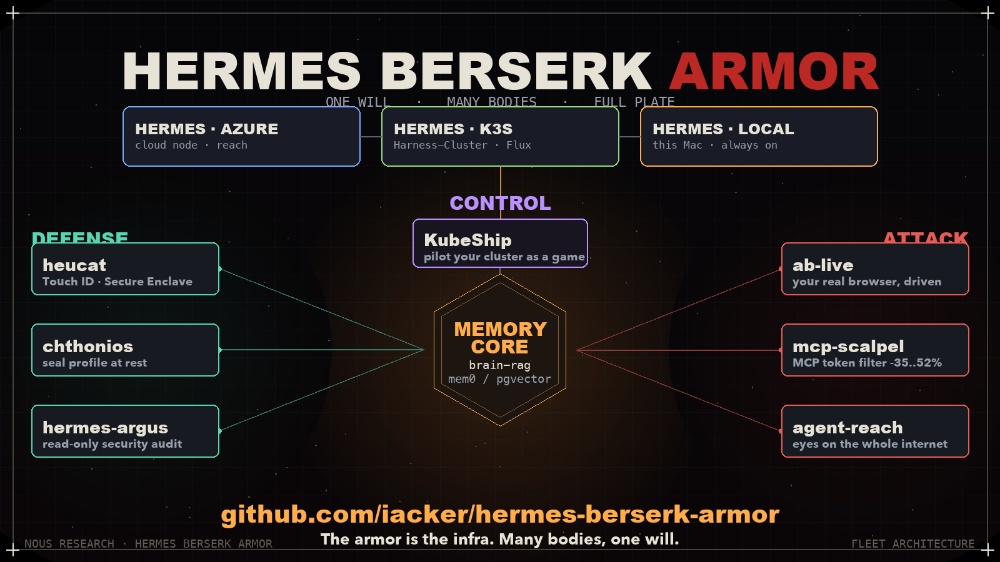

# HBA — Hermes Berserk Armor

HBA is a coherent set of extensions that turn a stock [Hermes](https://github.com/NousResearch/hermes-agent)
agent into a durable, contained, portable operator. It is not a fork and not a
framework: every component plugs into an existing Hermes extension point (MCP
server, plugin, secret source, profile). Installed together they form one system
with a clear division of labour — a memory the agent thinks with, a toolset it
acts with, and a set of controls that bound what any of it can do.

The organising principle is one sentence: **give the agent real power, and pair
every power with a control that limits the blast radius if it is ever turned.**



---

## Why this exists

A stock agent is stateless, trusting, and single-homed. Between sessions it
forgets; its secrets sit in a plaintext `.env`; its whole tool catalog is billed
on every turn; and it lives on exactly one machine. HBA fixes those four gaps
without changing Hermes core:

| Gap in a stock agent | HBA answer |
|----------------------|------------|
| Forgets between sessions | A four-tier memory architecture (below) |
| Secrets in plaintext, full trust | Hardware-sealed keys, encrypt-at-rest profile, continuous self-audit |
| Entire tool catalog billed every turn | Semantic tool-filtering proxy (`mcp-scalpel`) |
| Lives on one machine | One agent projected across a three-body fleet |

---

## Memory: why there are several layers

The layers are not redundant — each serves a different **timescale** and a
different **question**. Human memory separates working memory, episodic memory,
semantic knowledge, and skills for the same reason: one store optimised for
everything is good at nothing. HBA maps each tier to a purpose-built component.

| Tier | Question it answers | Timescale | Measured recall cost |
|------|--------------------|-----------|----------------------|
| Working | "What are we doing *right now*?" | this session | free, `hermes-lcm` compaction |
| Identity | "Who is this user and what do they always want?" | stable facts | free, but injected whole every turn |
| Episodic | "What happened in past sessions?" | across sessions | **MRR 0.623 in 2 ms**, lexical only, no LLM |
| Semantic | "What do I *know* about this topic/vault?" | permanent knowledge | **MRR 0.858**, hybrid + rerank, no LLM |
| Temporal graph | "Which fact superseded which, and when?" | fact lifecycle | **MRR 0.125 in 31 s**, one LLM call per write |
| Procedural | "How do I do this kind of task?" | permanent know-how | free, loaded on match, never benchmarked |

Every number above is a local measurement against this agent's real history, not
a vendor benchmark. The full breakdown, including six retrieval engines compared
on one bench and the ideas that were measured and rejected, is in
[docs/MEMORY.md](docs/MEMORY.md).

### How they work together

```
        turn N of a live session
                 |
                 v
   +-----------------------------+   working memory
   | hermes-lcm                  |   compacts the running conversation into a
   | (context compaction)        |   hierarchical summary DAG + a protected
   +--------------+--------------+   recent tail, so a long session never
                  |                  overflows the window
                  v
   +-----------------------------+   identity memory (always in context)
   | two self-edited md files    |   stable facts injected every turn, 0 ms,
   | 92% and 97% full, no decay  |   no lookup, and no forgetting either
   +--------------+--------------+
                  |
       need more? | retrieve on demand
                  v
   +--------------+--------------+   +-----------------------------+
   | EPISODIC                    |   | SEMANTIC                    |
   | SQLite FTS5, 9,179 messages |   | brain-rag hybrid over the   |
   | lexical only, zero vectors  |   | vault, 927 notes            |
   | 0.623 MRR / 2 ms            |   | 0.858 MRR                   |
   +--------------+--------------+   +--------------+--------------+
                  |                                 |
                  v                                 v
   +-----------------------------+   +-----------------------------+
   | TEMPORAL GRAPH (on probation)   | PROCEDURAL                  |
   | 531 facts, 28k edges        |   | 278 versioned skills        |
   | 0.125 MRR / 31 s            |   | loaded on match             |
   +--------------+--------------+   +--------------+--------------+
                  |                                 |
                  +----------------+----------------+
                                   v
                        answer for this turn
```

**Read path (per turn):** the agent first uses what is already in context
(working and identity tiers cost nothing to consult). It reaches into episodic
or semantic memory only when the current context is insufficient, taking the
narrowest bounded lookup that answers the question rather than a blanket search.

**Write path (background):** messages land in the episodic store as they happen,
vault notes are indexed for semantic recall, durable lessons are promoted into
identity memory so they load for free next time, and reusable procedures are
written as versioned skills. Only the temporal graph calls an LLM to write.

**What measuring changed.** Three popular additions were tested and dropped on
evidence: a vector store on episodic memory (dense ceiling 0.111, because a
technical conversation history is semantically homogeneous and its real
discriminators are exact identifiers), a knowledge graph for ranking (+0.004 MRR
against +0.22 for a reranker), and pgvector as a replacement store (0.465
against 0.858). A lexical oracle built from answer keywords finds the target at
rank 1 in 37 out of 37 cases, which proves storage was never the bottleneck:
every failure is a query or a ranking failure.

The net effect: the agent behaves as if it has one memory, each question is
served by the store that answers it cheapest, and no layer survives on
reputation alone.

---

## Working and acting: the tool strategy

The strategy is **broad capability, loaded on demand, kept cheap, and bounded.**

### The token problem, and mcp-scalpel

The reason a big toolset is normally a bad idea is cost, not confusion. When an
MCP client connects to a gateway exposing many tools, the **entire catalog** —
every tool's name, description, and JSON input schema — is injected into **every**
LLM call. Measured on a live Docker MCP Gateway: 49 tools ≈ **18,700 input
tokens per turn**, re-sent on every single message, forever.

`mcp-scalpel` removes that tax. It sits as a stdio proxy *between* the client and
the gateway, intercepts `tools/list`, and returns only the tools relevant to the
current session — typically ~15 of 49 — relaying everything else verbatim.
Measured result: **35-52% fewer catalog tokens per turn.** Because a proxy never
sees the user's prompt (only JSON-RPC frames), it routes on session context —
a task hint plus recently-called tool names — and exposes a meta-tool
`scalpel_search_tools(query)` so the agent can pull any hidden tool's full schema
on demand (progressive disclosure). Low-signal queries fall back to the full
catalog and `tools/call` is always relayed, so a hidden tool is never
*un*callable. Pure-numpy TF-IDF by default: milliseconds, no cloud, no downloads.

**This is the keystone of the reach layer**: it is what makes "give the agent a
lot of tools" affordable instead of a permanent per-turn cost.

### The rest of the reach layer

- **`ab-live` — act as you, where no API exists.** Drives your *real* browser
  (cookies, sessions, extensions) live inside the Hermes pane, not a headless
  throwaway. The agent operates authenticated sites as you.
- **`excalibur` — scan to submission-ready report.** Turns raw nuclei output into
  a scope-enforced, deduplicated report you can actually file (Hermes MCP server).
- **`Mando` — autonomous bug-bounty operator.** Runs the full hunt loop (Hermes +
  Boba MCP + Exegol) without hand-holding.
- **Domain MCP servers** — `blender` (3D), `vibe-trading` (markets), `erp`
  (business data) extend reach into whole domains, each cheap to keep because
  scalpel only surfaces them when relevant.

Every one of these acts on the real world, and none of them holds a plaintext
secret or an irreversible key — that is guaranteed by the defense layer below,
not by good behaviour.

---

## Defense: capability without blast radius

An AI agent with a shell is a powerful thing pointed at your machine, and prompt
injection means a bad instruction will eventually slip through. So the real work
is not preventing every compromise — it is making sure a compromised agent has
little worth stealing and little it can undo. The three defense tools attack that
from three angles: **where secrets live**, **whether the agent may hold them at
all**, and **how exposed the whole setup actually is.**

### heucat — the key never leaves the hardware

*Hardware Enclave Credential Authentication Tool.* A stock agent keeps its API
keys in a plaintext `.env` — one file read away from exfiltration. heucat serves
those keys from the macOS Keychain instead, encrypted with a key that **never
leaves the Secure Enclave** and gated behind Touch ID. It plugs in as a Hermes
secret source, so the agent asks for a key by name and the enclave decides
whether to release it. Even with full shell access, there is no plaintext key
file to read. *Controls the power: "the agent holds API keys."*

### hermes-chthonios — the agent can lock itself out

A secret manager decides **where** credentials live; chthonios decides **whether
a profile is allowed to hold them at all.** It encrypts a profile's `.env` into
ciphertext. A sealed profile's gateway starts, finds no key, and cannot call any
model until a human unlocks it. The asymmetry is the point:

> Sealing needs only a public recipient — so an unattended agent can seal itself.
> Unsealing needs the physical YubiKey in someone's hand (touch + PIN).

An autonomous agent can therefore **revoke its own access to its credentials
without keeping the means to undo it.** A UI passcode only stops a glance at your
screen and is bypassable from a shell because the plaintext is still there;
chthonios removes the plaintext, so there is nothing to bypass. *Controls the
power: "the agent's profile holds state at rest."*

### hermes-argus — an honest, read-only measure of the blast radius

You cannot bound a blast radius you cannot see. argus reads the Hermes config and
**cross-checks it against the ports actually listening on the machine**, then
grades real exposure. It answers concrete questions: is the shell sandboxed or
running straight on the host? Are risky actions gated behind human approval? Is
the dashboard published without a password? Are A2A / MCP ports reachable from
the LAN without auth? Are secrets kept out of the execution environment and logs?
Unlike scanners that scream `CRITICAL` at a healthy setup, argus scores honestly
— only real issues lower the grade — and **never reads or writes a secret, never
changes anything.** *Measures how well the other two controls are actually
holding.*

Together: heucat means a stolen `.env` yields nothing, chthonios means an
idle or suspect agent can be put beyond use of its own keys, and argus keeps you
honest about how exposed the running system really is. None of the three limits
what the agent is *meant* to do — they limit what an attacker gains the day it is
fooled.

---

## Control: seeing and steering the fleet

`KubeShip` turns the Kubernetes fleet into a visual, steerable interface, backed
by `Harness-Cluster` — the GitOps k3s setup (Flux CD) that keeps the agents
running 24/7.

---

## The fleet: one will, three bodies

The same agent, the same memory, the same toolset, projected onto three bodies
so the operator is always reachable and never single-homed:

| Body | Role | Backed by |
|------|------|-----------|
| Hermes · Azure | Cloud node, always reachable | Azure GPU / VM |
| Hermes · k3s | 24/7 harness cluster, GitOps | `Harness-Cluster` (Flux CD) |
| Hermes · Local | Hardware-gated workstation | this Mac, always on |

Because memory (episodic, semantic, identity) lives in shared stores rather than
in any one process, the agent carries the same context whichever body answers.

---

## Why it fits Hermes natively

HBA adds nothing that Hermes does not already have a socket for. That is the
whole point — it is a curated bundle of native extensions, so it upgrades cleanly
with the agent and can be adopted piece by piece.

| Component | Hermes extension point |
|-----------|------------------------|
| `brain-rag-server`, `neuromancer`, `agentmemory`, `excalibur` | MCP servers (stdio) |
| `hermes-lcm`, `tokenwatch`, `audit_to_db` | Hermes plugins |
| `heucat` | secret source (keys resolved through the Hermes keychain source) |
| `hermes-chthonios` | operates on the Hermes profile directory |
| `hermes-argus` | reads the Hermes config, read-only |
| `mcp-scalpel` | transparent proxy in front of the MCP gateway |

No fork, no patched core. Remove any single component and Hermes still runs; add
them together and you get the system above.

---

## Component status

Public components are vendored as git submodules under `components/`. Private
components are listed for completeness (source not published). The *origin*
column is honest about authorship: HBA is a system, and part of the point is that
self-built tools sit next to well-chosen third-party ones under one coherent set
of controls.

| Component | Layer | Origin | Visibility |
|-----------|-------|--------|------------|
| [`brain-rag-server`](components/core/brain-rag-server) | Core / semantic | self-built | public (submodule) |
| `agentmemory` | Core / episodic | third-party, integrated | integration |
| `neuromancer` | Core / semantic | self-built | private |
| `mem0` / `pgvector` | Core / identity | third-party, integrated | integration |
| `hermes-lcm` | Core / working | Hermes plugin | plugin |
| [`mcp-scalpel`](components/reach/mcp-scalpel) | Reach | self-built | public (submodule) |
| `ab-live` | Reach | self-built | private |
| `excalibur` | Reach | self-built | private |
| `Mando` | Reach | third-party, operated | private |
| [`heucat`](components/defense/heucat) | Defense | self-built | public (submodule) |
| [`hermes-chthonios`](components/defense/hermes-chthonios) | Defense | self-built | public (submodule) |
| [`hermes-argus`](components/defense/hermes-argus) | Defense | self-built | public (submodule) |
| `KubeShip` | Control | self-built | private |
| `Harness-Cluster` | Control | self-built | private |

---

## Architecture

Full diagram and data flow: [`docs/ARCHITECTURE.md`](docs/ARCHITECTURE.md).
Animated schematic: [`assets/fleet-architecture.mp4`](assets/fleet-architecture.mp4).

## Working with submodules

```bash
# clone with all public components
git clone --recurse-submodules https://github.com/iacker/HBA.git

# or, after a plain clone
git submodule update --init --recursive

# update every component to its latest upstream commit
git submodule update --remote --merge
```

## Repository layout

```
HBA/
├── README.md
├── components/
│   ├── core/   brain-rag-server            (submodule)
│   ├── reach/  mcp-scalpel                 (submodule)
│   └── defense/heucat, hermes-chthonios, hermes-argus   (submodules)
├── docs/       ARCHITECTURE.md
├── prompts/    hero-video.md
└── assets/     fleet-architecture.mp4, .png
```

---

Built around [Hermes Agent](https://github.com/NousResearch/hermes-agent) by [@iacker](https://github.com/iacker).
