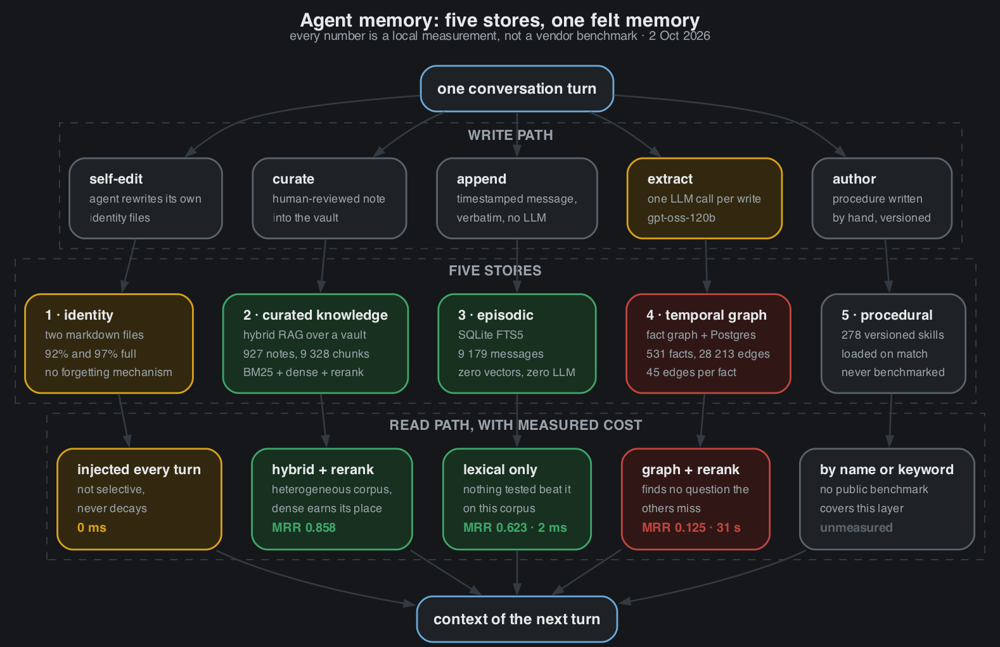
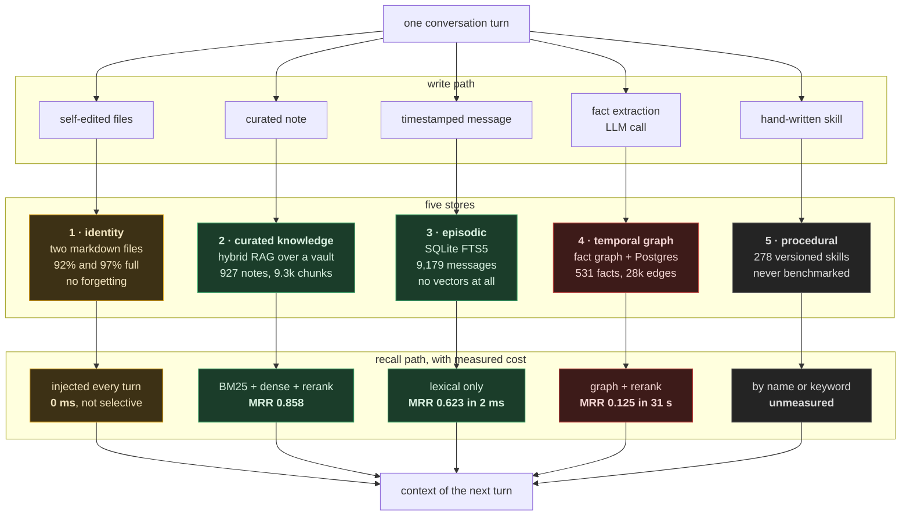
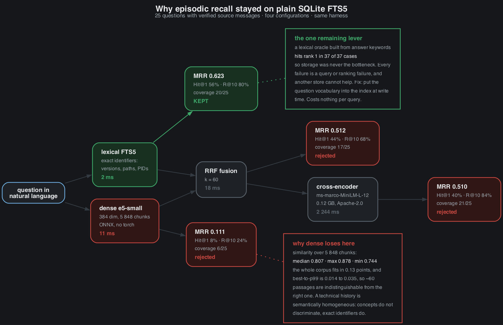
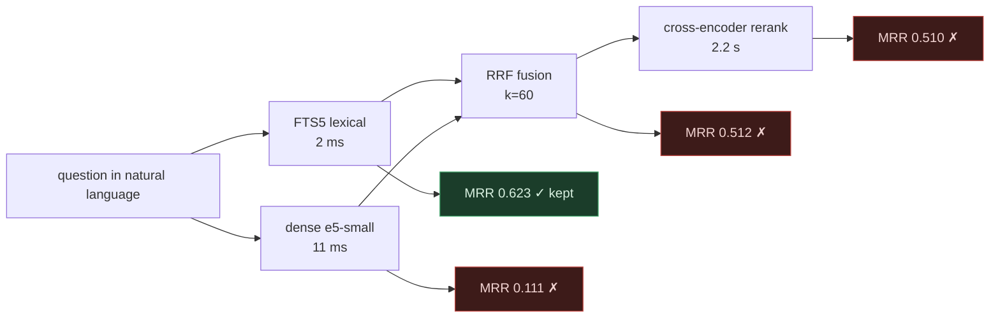

# Memory

How one Hermes agent remembers, what each layer actually costs, and which
popular ideas were measured and rejected.

Every number here comes from a local measurement against the agent's real
conversation history and its real note vault. None of it is estimated, and none
of it is a vendor benchmark. Measured 2 October 2026.



## Five layers, not four

The agent does not have "a memory". It has five stores with different physics,
and the only interesting question is which one answers which question, and at
what price.



| Layer | Question it answers | Cost per recall | LLM |
|---|---|---|---|
| 1 identity | who is this user, what do they always want | free, but injected whole every turn | none |
| 2 curated knowledge | what do I know about this topic | tens of ms | none |
| 3 episodic | what happened in a past session | **2 ms** | none |
| 4 temporal graph | which fact superseded which, and when | **31 s** | one per write |
| 5 procedural | how do I do this kind of task | free, loaded on match | none |

## The measurement that mattered most

Twenty-five questions were written against the agent's real history, each with a
verified source message and answer keywords. Then a lexical oracle was built
from the answer keywords and run against the same index.

**The oracle finds the target at rank 1 in 37 out of 37 cases.**

That single result reframes everything. The data is not missing, it is not badly
chunked, and the index is not broken. Every recall failure is a query failure or
a ranking failure, which means the ceiling is 100% coverage without touching
storage at all. It also means that adding another memory store cannot help, and
that is exactly the mistake most memory stacks make.

## Six retrieval engines on one bench





| Configuration | Hit@1 | R@5 | R@10 | Coverage | MRR | Latency | Verdict |
|---|---|---|---|---|---|---|---|
| **lexical FTS5 alone** | 56% | 68% | 80% | 20/25 | **0.623** | 2 ms | kept |
| hybrid + cross-encoder rerank | 40% | 72% | 84% | 21/25 | 0.510 | 2,244 ms | rejected |
| hybrid lexical + dense, RRF | 44% | 60% | 68% | 17/25 | 0.512 | 18 ms | rejected |
| full-text search over session store | 24% | 60% | 64% | 16/25 | 0.377 | 245 ms | rejected |
| dense `multilingual-e5-small` alone | 8% | 20% | 24% | 6/25 | 0.111 | 11 ms | rejected |
| temporal fact graph | 0% | 0% | 0% | 0/25 | 0.000 | 28,783 ms | out of its time window |

The same pipeline that scores **0.858** on the note vault scores **0.510** on
conversation history. Same code, same models, opposite outcome. That gap is the
most useful thing in this document.

## Why dense retrieval loses on conversation history

Measured over 5,848 conversation chunks, for a given query: median similarity
**0.807**, max **0.878**, min **0.744**. The entire corpus fits inside **0.13
points**, and the gap between the best chunk and the 99th percentile is **0.014
to 0.035**. Roughly sixty passages are indistinguishable from the right one.

A technical conversation history is semantically homogeneous. Everything in it
talks about the same few subjects, so concepts do not discriminate. What does
discriminate is exact identifiers: a version string, a file path with a line
number, a commit count, a PID. Lexical search captures those, embeddings flatten
them. A note vault is heterogeneous, which is why the dense branch earns its
place there and not here.

**Method warning, learned the hard way.** A preliminary test showed 0.849
cosine similarity between a paraphrased question and its target passage, and
that was read as strong signal. It was not: 0.849 is the median of this corpus.
An absolute cosine similarity proves nothing without its distribution. Always
report max, p99, median and min over the full corpus for the same query.

## What was measured and rejected

Rejecting things on evidence is most of the value here.

| Idea | Why it was rejected | Evidence |
|---|---|---|
| vector store on episodic memory | dense ceiling is 0.111, distribution collapsed | local bench |
| knowledge graph for ranking | +0.004 MRR against +0.22 for a reranker | local bench |
| Neo4j, pgvector | lab pgvector peaks at 0.465 against 0.858 for the current stack | local bench |
| HyDE | needs a generative call per query, and the original vendor reports "very limited gains" for the neighbouring idea | disqualified by constraint |
| ColBERT, late interaction | one vector per token, index not native to SQLite | storage cost |
| SPLADE | encoder per query, sparse index not native to FTS5 | integration cost |
| replacing BM25 with dense | the lexical oracle already hits rank 1 at 100% | local bench |
| a sixth memory layer | the temporal graph answers zero questions no other layer answers | local bench |

The temporal graph deserves its own line. It consumed 847,949 input and 327,764
output tokens in a single day, 58 minutes of LLM time, carries 28,213 edges for
628 nodes (45 edges per fact), answers in 31 seconds, and finds **no question
that lexical search misses**. Its only measured advantage is numeric facts,
0.333 against 0.048. It is a narrow reranker priced like a primary store.

## The one remaining lever

Since the lexical oracle finds the target at rank 1 every time, the fix is not a
different search engine. It is to put the vocabulary of the question into the
index.


Write-time expansion costs nothing per query, stays entirely inside SQLite, and
is the only figure in the whole literature review that was **reproduced by an
independent third party**: +16% retrieval effectiveness with a 33% smaller index
and 23% faster queries (Doc2Query--, ECIR 2023, arXiv:2301.03266).

## A timeout disguised as a regression

Worth writing down because it was published wrong for twenty minutes.

The temporal graph carried 24% redundancy at Jaccard 0.65 and 9% at 0.85. 49
duplicate facts were retired, redundancy dropped to 0% at the same threshold,
and the same 12-question bench was re-run. The summary metrics looked damning:

| Metric | Before dedup | After dedup |
|---|---|---|
| MRR | 0.125 | 0.042 |
| Hit@1 | 8% | 0% |
| R@10 | 17% | 8.3% |

The first reading was that deduplication had removed recall surface, because
near duplicates are alternative phrasings and each phrasing is an entry point.
That story is plausible, it is consistent with why write-time expansion works,
and it was wrong.

Per-question ranks tell the real story:

```
before : [0,0,1,0,0,0,0,0,0,0,2,0]
after  : [0,0,0,0,0,0,0,0,0,0,2,0]
              ^ the only difference
```

That single question is the one that **timed out at 60 s** in the second run.
It was found at rank 1 before, and in the second run the server never answered.
Deduplication changed nothing measurable. Recall is identical, one hit out of
twelve in both runs, and the entire apparent regression is one expired request.

**Lessons, in order of value.**

1. **Never read a memory benchmark from aggregate metrics alone.** MRR, Hit@1
   and R@10 all moved in the same direction and all three were artefacts. Print
   per-question ranks and diff them; a single changed position invalidates a
   story built on three metrics.
2. **Count errors as a metric, not as noise.** A harness that silently scores a
   timeout as "not found" converts an infrastructure problem into a fake quality
   regression. Report timeouts and transport errors separately from misses.
3. **Size the timeout from the measured latency distribution.** Observed
   latencies ran 26 to 58 s against a 60 s timeout, so the bench was operating
   inside its own error margin. Set the timeout to several times the p99, not
   just above the median.
4. **A plausible mechanism is not evidence.** The "redundancy is recall surface"
   explanation was coherent enough to be convincing and survived review precisely
   because it sounded right. Check the raw per-item data before accepting any
   mechanism, especially a satisfying one.

What does hold, independently of this episode: deduplication was performed as a
reversible state change rather than a delete, with a full export taken first.
That is the right default for a memory store, because a row that looks redundant
to a human can be the only phrasing a future query will match.

## Two unsolved defects

**The identity layer saturates with no forgetting.** 92% and 97% full, injected
in full every single turn, never decaying. It is the only place where this
memory is mathematically guaranteed to overflow, and no amount of retrieval
tuning touches it.

**The procedural layer is unmeasured.** 278 versioned skills, no bench, so there
is no evidence about what loads when it should not, or never loads at all. It is
also the most unusual layer in the stack: almost nobody version-controls
procedural memory, and no public benchmark covers it.

## Reproducing this

The harness is four small scripts and two JSON benches. Rules that matter more
than the code:

1. **Every engine returns identifiers, never text.** If one engine returns a
   whole document and another a 700-character fragment while the relevance
   criterion needs a share of keywords inside the returned snippet, the two are
   judged by different rules. Fixing exactly that bias moved a hybrid variant
   from 0.255 to 0.512, a factor of two.
2. **Never rank a memory engine on MRR alone.** Compare coverage, then compute
   the fusion oracle. An engine can improve MRR by 57% while finding zero
   questions the baseline misses, which makes it a reranker, not a source.
3. **Build a lexical oracle first.** If it finds the target, the problem is not
   your data, and no new store will help.
4. **Test every reranker in the target language before integrating it.** One
   widely used "multilingual" reranker returned scores collapsed to -10.194 and
   inverted the ranking in French while working correctly in English.
5. **Check the licence of every model.** A popular multilingual reranker is
   CC-BY-NC, which rules it out of commercial use.

## Design principle

Measure before adding. Five stores already cover more ground than most published
stacks, and the measured bottleneck is never storage. It is the distance between
how a question is phrased and how the answer was written down. Close that
distance at write time, and the cheapest index in the stack becomes the best
one.
